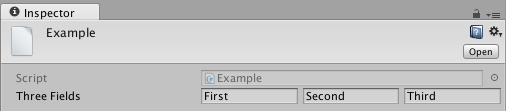
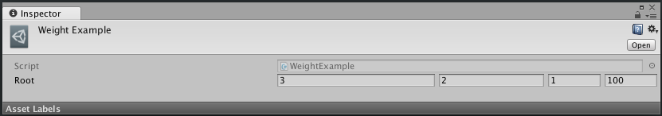
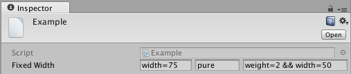
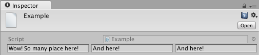
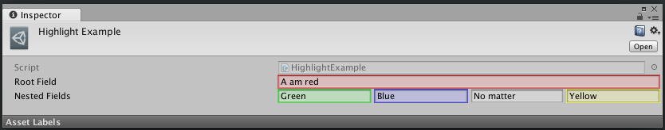
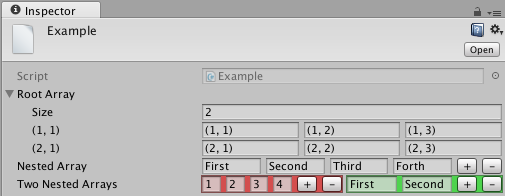
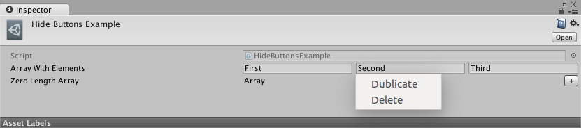
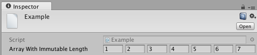
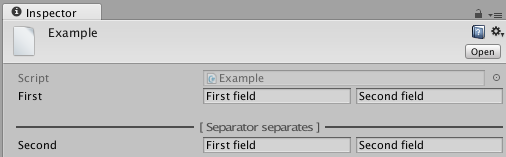

# Overview

OneLine improves your databases and makes it more readable by people. It draws objects in Inspector into one line instead default line-by-line style. Also it provides a few features like fields highlightning, locking array size, etc...

# TL;DR

- After importing look at `Assets/Example/Example.asset` and open it in InspectorWindow. It will show you all capabilities of OneLine library.
- In your code, add `using OneLine;` and add `[OneLine]` to fields you want to draw into one line. Note that internal fields don't need `OneLine`: they will processed automatically.
- If you want to customize onelined fields, use **Width**, **Weight**, **HideLabel**, **Highlight**, **HideButtons** and **ArrayLength** attributes (see **Example.asset**).
- Use **Separator** attribute to separate different fields.

# Details

## OneLinePropertyDrawer

`OneLinePropertyDrawer` is a custom property drawer. It draws any property into single line. To nicely draw your custom data class into one line, just extend `OneLinePropertyDrawer`. Every time your class will be drawn in single line without any additional attributes.

**Example:**

```csharp
// ./Example.cs
using System;
using UnityEngine;
using OneLine;

[CreateAssetMenu(menuName = "OneLine/OneLineDrawerExample")]
public class OneLineDrawerExample : ScriptableObject {

    [SerializeField]
    private RootField root;
    [Space]
    [SerializeField, HideLabel]
    private RootField[] rootArray;

    [Serializable]
    public class RootField {
        [SerializeField]
        private string first;
        [SerializeField]
        private Color second;
        [SerializeField]
        private NestedField third;
    }

    [Serializable]
    public class NestedField {
        [SerializeField, Tooltip("This tooltip is very useful")]
        private bool first;
        [SerializeField]
        private Vector2 second;
    }
}

// ./Editor/ThreeFieldsDrawer.cs
using UnityEditor;
using OneLine;

[CustomPropertyDrawer(typeof(OneLineDrawerExample.RootField))]
public class OneLineDrawerExampleEditor : OneLinePropertyDrawer {
}
```

**Result:**



## Attributes

It is not nice to create additional classes for every data class you want one-linify in Inspector. There is a couple of attributes created for make your life better.

### [OneLineAttribute]

`[OneLine]` is the core of all library. Add it to any field drawn in Inspector and its view will be chanded: with all children it will be drawn into one line (and arrays with all elements and their children). It works fully recursive and automatic. You don't need to add `[OneLine]` to every field -- just to root. `[OneLine]` uses all other attributes to customize view. But other attributes is just markers and containers for settings (for example, `[Weight]` tells to `[OneLine]` that this field must me wery long, but it is not draws anything be itself). Except `[Separator]`: it is used as marker and as drawer depends on context.

**Example:**

```csharp
using System;
using UnityEngine;
using OneLine;

[CreateAssetMenu(menuName = "OneLine/OneLineExample")]
public class OneLineExample : ScriptableObject {

    [SerializeField, OneLine]
    private RootField root;
    [Space]
    [SerializeField, OneLine, HideLabel]
    private RootField[] rootArray;

    [Serializable]
    public class RootField {
        [SerializeField]
        private string first;
        [SerializeField]
        private Color second;
        [SerializeField]
        private NestedField third;
    }

    [Serializable]
    public class NestedField {
        [SerializeField, Tooltip("This tooltip is very useful")]
        private bool first;
        [SerializeField]
        private Vector2 second;
    }
}
```

**Result:**


---

### [WeightAttribute]

`[Weight]` allows you to manage relative sizes of fields. For example, if class contains two fields: short integer ID and long string UUID, you can use `[Weight]` to set UUIDs length equals 8 IDs lenghtes. Added to array, specifies weight of every array element.  
Note that values of `[Width]` and `[Weight]` are summarized: you cat set weight=2 and width=25 and field will be as two simple fields plus 25.
Note that attributes `[Width]` and `[Weight]` doesn't work with complex fields.

**Example:**
```csharp
using System;
using UnityEngine;
using OneLine;

[CreateAssetMenu(menuName = "OneLine/WeightExample")]
public class WeightExample : ScriptableObject {
    [SerializeField, OneLine]
    private RootField root;

    [Serializable]
    public class RootField {
        [SerializeField, Weight(3)]
        private int first;
        [SerializeField, Weight(2)]
        private int second;
        [SerializeField] // by default weight == 1
        private int third;
        [SerializeField, Weight(10)]
        private NestedField forth;
    }

    [Serializable]
    public class NestedField {
        [SerializeField]
        private int first;
    }
}
```

**Result:**



---

### [WidthAttribute]

`[Width]` is same as `[Weight]` but operates with fixed widthes. It allows you to set fields width to 50. It uses GUI units (like all property drawers). It set Weight of field to 0 (zero), but you can change it with `[Weight]`. Added to array, specifies width of every array element.  
Note that values of `[Width]` and `[Weight]` are summarized: you cat set weight=2 and width=25 and field will be as two simple fields plus 25.
Note that attributes `[Width]` and `[Weight]` doesn't work with complex fields.

**Example:**
```csharp
using System;
using UnityEngine;
using OneLine;

[CreateAssetMenu(menuName = "OneLine/WidthExample")]
public class WidthExample : ScriptableObject {
    [SerializeField, OneLine]
    private RootField root;

    [Serializable]
    public class RootField {
        [SerializeField, Width(70)]
        private string first;
        [SerializeField] // by default width = 0
        private string second;
        [SerializeField, Weight(2), Width(25)]
        private string third;
        [SerializeField, Width(10000000)]
        private NestedField forth;
    }

    [Serializable]
    public class NestedField {
        [SerializeField]
        private string first;
    }
}
```

**Result:**



---

### [HideLabelAttribute]

`[HideLabel]` allows you to hide prefix label in view. It is useful to prevent width looses and draw your data in whole line. It works only with root fields (with nested fields labels aren't drawn). Added to array, hides labels of every array element.

**Example:**

```csharp
using System;
using UnityEngine;
using OneLine;

[CreateAssetMenu(menuName = "OneLine/HideLabelExample")]
public class HideLabelExample : ScriptableObject {
    [SerializeField, OneLine, HideLabel]
    private ThreeFields thisSelfDocumentedFieldNameWillNotBeShownInTheInspector;

    [Serializable]
    public class ThreeFields {
        [SerializeField]
        private string first;
        [SerializeField]
        private string second;
        [SerializeField]
        private string third;
    }
}
```

**Result:**



---

### [HighlightAttribute]

`[Highlight]` allows you to highlight field with some color (r, g, b). C sharp doesn't allow to pass custom classes or struct to attributes, sou you need to pass three float in [0..1]. If you add `[Highlight]` to root field, it highlightes its prefix label too; if you add `[Highlight]` to nested field, it also highlights. Even in arrays.

**Example:**

```csharp
using System;
using UnityEngine;
using OneLine;

[CreateAssetMenu(menuName = "OneLine/HighlightExample")]
public class HighlightExample : ScriptableObject {
    [SerializeField, OneLine, Highlight]
    private string rootField;
    [SerializeField, OneLine] 
    private HighlightedFields nestedFields;

    [Serializable]
    public class HighlightedFields {
        [SerializeField, Highlight(0, 1, 0)]
        private string first;
        [SerializeField, Highlight(0, 0, 1)]
        private string second;
        [SerializeField]
        private string third;
        [SerializeField, Highlight(1, 1, 0)]
        private string fourth;
    }
}
```

**Result:**



---

### Root arrays with `[OneLine]`

If you add `[OneLine]` to field, which contains arrays in children, arrays of this elements will be linified. But if you add `[OneLine]` to array, instead drawing whole array into one line, it will draw array line-by-line (as usial), but every element will be drawn into one line.

**Example:**

```csharp
using System;
using UnityEngine;
using OneLine;

[CreateAssetMenu(menuName = "OneLine/RootArrayExample")]
public class RootArrayExample : ScriptableObject {
    [SerializeField, OneLine]
    private RootField[] rootArray;
    [Space]
    [SerializeField, OneLine]
    private SingleArray singleNestedArray;
    [SerializeField, OneLine]
    private TwoArrays twoNestedArrays;

    [Serializable]
    public class RootField {
        [SerializeField]
        private string first;
        [SerializeField]
        private string second;
        [SerializeField]
        private string third;
    }
    [Serializable]
    public class SingleArray {
        [SerializeField]
        private string[] array;
    }
    [Serializable]
    public class TwoArrays {
        [SerializeField, Highlight(1, 0, 0)]
        private int[] first;
        [SerializeField, Highlight(0, 1, 0), Width(125)]
        private string[] second;
    }
}
```

**Result:**



---

### [HideButtonsAttribute]

`[HideButtons]` hides buttons **+** and **-** from array. It allow you to increase useful space. You may change array size with Right-click drop-down menu. When array contains 0 (zero) elements, button **+** appears, when you click it, buttons dissapears.
`[HideButtons]` works only with nested arrays.

**Example:**

```csharp
using System;
using UnityEngine;
using OneLine;

[CreateAssetMenu(menuName = "OneLine/HideButtonsExample")]
public class HideButtonsExample : ScriptableObject {
    [SerializeField, OneLine]
    private ArrayHidesButtons arrayWithElements;
    [SerializeField, OneLine]
    private ArrayHidesButtons zeroLengthArray;

    [Serializable]
    public class ArrayHidesButtons {
        [SerializeField, HideButtons]
        private string[] array;
    }
}
```

**Result:**



---

### [FixedLengthAttribute]

Specifies fixed lenth of array. Useful for need to set up fixed number of integers and you don't want to create a lot of hardcoded fields or you need to iterate them at runtime (it is not nice to iterate fields).  
`[FixedLength]` works only with nested arrays.

**Example:**

```csharp
using System;
using UnityEngine;
using OneLine;

[CreateAssetMenu(menuName = "OneLine/FixedLengthExample")]
public class FixedLengthExample : ScriptableObject {
    [SerializeField, OneLine]
    private ImmutableLengthArray arrayWithImmutableLength;

    [Serializable]
    public class ImmutableLengthArray {
        [SerializeField, ArrayLength(7)]
        private string[] array;
    }
}
```

**Result:**



---

### [SeparatorAttribute]

`[Separator]` allows you to separate fields from each other (like `[Space]` but better). Added to root field, draws a horizontal line with label. Added to nested field, draws a vertical line inside line.

**Example:**

```csharp
using System;
using UnityEngine;
using OneLine;

[CreateAssetMenu(menuName = "OneLine/SeparatorExample")]
public class SeparatorExample : ScriptableObject {
    [SerializeField, OneLine]
    private TwoFields first;

    [Space]
    [SerializeField, Separator("[ Separator separates ]"), OneLine]
    private TwoFields second;

    [Serializable]
    public class TwoFields {
        [SerializeField]
        private string first;
        [SerializeField, Separator]
        private string second;
    }
}
```

**Result:**


